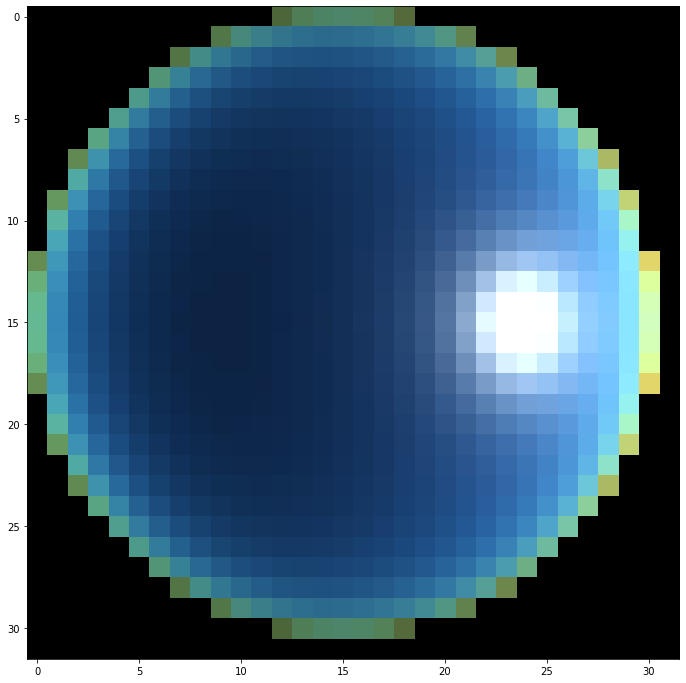

```python
%matplotlib inline
```


```python
import numpy as np
import matplotlib.pyplot as plt

import imageio
from IPython.display import Image
```


```python
from py_sky import set_scene, render, show
```


```python
scene = set_scene(zenith=45, azimuth=180, width=32, height=32)
```


```python
rgb = render(scene)
```


```python
show(rgb)
```





```python
width=32
heigth=32

images = list()

for i, zenith in enumerate(np.arange(0, 100, 5)):
    scene = set_scene(zenith=zenith, azimuth=180, width=width, height=heigth)
    
    r, g, b = render(scene)
    
    data = np.zeros((width, heigth, 3))
    data[..., 0] = r
    data[..., 1] = g
    data[..., 2] = b
    
    filename = 'sky_' + str(i).zfill(2) + '.png'
    imageio.imwrite(filename, data)
    
    images.append(imageio.imread(filename))
```


```python
tmp = images.copy()
tmp.reverse()
```


```python
imageio.mimsave('movie.gif', images + tmp, fps=60, duration=0.1)
```


```python
Image(filename='movie.gif', width=500, height=500)
```


    


```python

```
